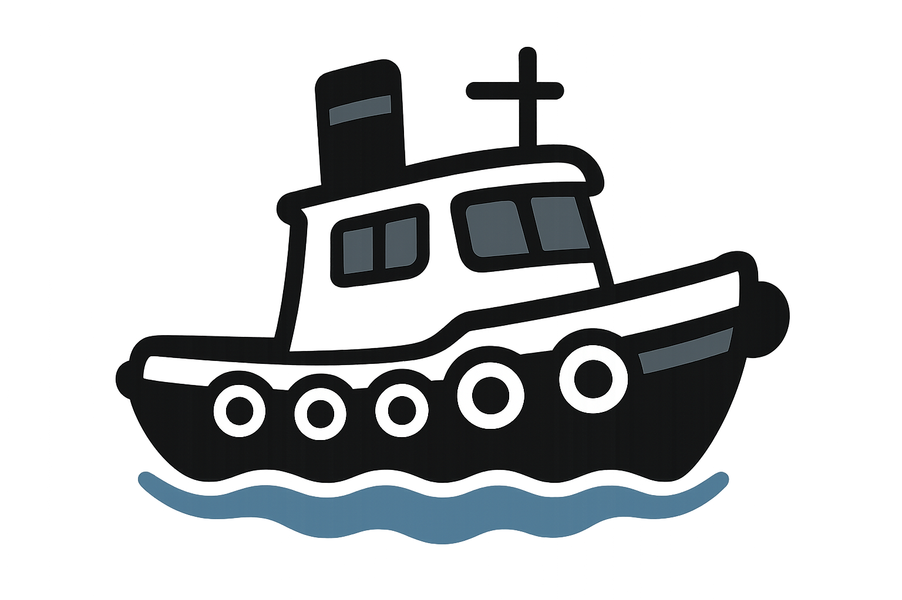

  

# Tugboat

**Tugboat** is a Docker management system designed to make self-hosting your projects easy, secure, and efficient.

## Features

- **Simple Docker Management:** Easily deploy, manage, and monitor your self-hosted projects using an intuitive web interface.
- **Built-in Dynamic DNS (DDNS):** Automatically keep your domain names updated with your current IP address, ensuring your services are always reachable.
- **Integrated Reverse Proxy:** Effortlessly expose your services to the internet with automatic SSL and routing, powered by a built-in reverse proxy.
- **User Management:** Secure authentication and user settings for multi-user environments.

## Why Tugboat?

Tugboat streamlines the process of running and exposing Dockerized applications at home or on your server. With built-in DDNS and reverse proxying, you can focus on your projects instead of networking headaches.

---

For setup instructions, configuration, and more, see the documentation or explore the codebase.
